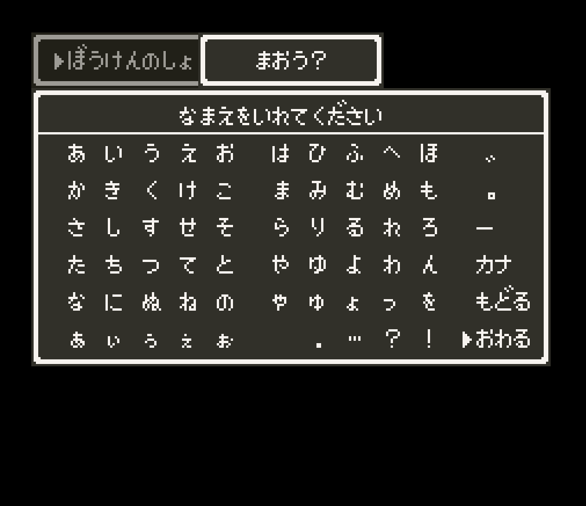

# dq3
dq3 theme

# .dq3 .dq3.full
サイズ固定版と固定しない版を作る。
```
.dq3{
 ...
 width:480px;
}
.dq3.full{
 ...
 width:100%;
}
```

# dq3 editor
- if add body.readonly is readonly mode. can not edit.
```
document.body.append(new dq3().ed)
```

# image

